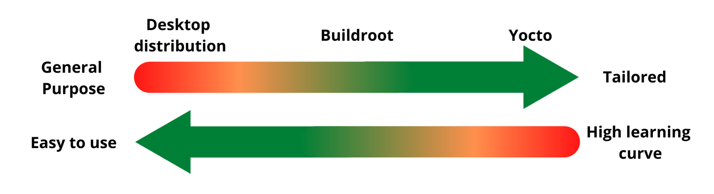

# ☝ Page 1 Yocto介绍及学习方法

## 引言

在当今数字化时代，嵌入式系统已经成为我们日常生活中不可或缺的一部分。从智能手机到智能家居，从工业自动化到医疗设备，嵌入式系统的应用范围越来越广泛。然而，构建一个高效、可靠且定制化的嵌入式系统并不是一项容易的任务。这就是嵌入式系统构建框架的重要性所在。

嵌入式系统构建框架是一种软件工具集合，它提供了一套结构化的方法和工具，用于简化和加速嵌入式系统的开发过程。它可以帮助开发人员从头开始构建一个完整的嵌入式系统，包括操作系统、驱动程序、应用软件等。同时，它还提供了丰富的功能和组件，使开发人员能够根据特定需求进行定制和扩展。

在众多的嵌入式系统构建框架中，Yocto已经成为了一种流行的选择。Yocto是一个开源的、灵活且强大的嵌入式系统构建框架，它由Linux基金会支持并拥有一个活跃的社区。Yocto提供了一套完整的工具链和文档，使开发人员能够轻松地构建、定制和管理嵌入式系统。

Yocto的流行程度源于其独特的优势。首先，Yocto具有高度的灵活性，可以适应各种硬件平台和应用场景。其次，Yocto提供了丰富的软件包和组件，使开发人员能够快速构建功能丰富的嵌入式系统。此外，Yocto还支持定制化开发，开发人员可以根据项目需求添加或删除软件包、调整系统设置，以满足特定的要求。

在本文中，我们将深入探讨Yocto嵌入式系统构建框架的各个方面。我们将介绍Yocto的学习方法，帮助读者快速上手并掌握Yocto的使用。我们还将详细讨论Yocto的构建流程、定制化方法以及最佳实践。最后，我们将探索Yocto在实际应用中的案例，并展望Yocto在嵌入式系统开发领域的潜力。

### Yocto构建框架的重要性和作用

1. 提供灵活性和可定制性：Yocto构建框架为开发人员提供了高度的灵活性和可定制性。它允许开发人员根据特定需求选择和配置所需的软件包、功能和组件。这种灵活性使得开发人员能够构建定制化的嵌入式系统，满足各种不同的应用场景和硬件平台的要求。
2. 加速开发过程：Yocto构建框架提供了一套完整的工具链和文档，使开发人员能够快速构建嵌入式系统。它提供了自动化的构建流程和工具，简化了繁琐的配置和编译过程。这样，开发人员可以专注于应用程序和功能的开发，而不必花费过多时间和精力在底层系统构建上。
3. 提供丰富的软件包和组件：Yocto构建框架提供了广泛的软件包和组件，涵盖了各种常用的开源软件和工具。这些软件包和组件可以用于构建各种功能丰富的嵌入式系统，如网络通信、图形界面、数据库等。开发人员可以根据项目需求选择和集成这些软件包和组件，从而快速构建出具备所需功能的嵌入式系统。
4. 支持多种硬件平台：Yocto构建框架支持多种不同的硬件平台，包括ARM、x86、PowerPC等。这意味着开发人员可以使用同一套工具和流程构建适用于不同硬件平台的嵌入式系统。这种跨平台的支持使得开发人员能够更加灵活地选择硬件平台，同时减少了开发和维护多个平台的工作量。
5. 社区支持和持续更新：Yocto构建框架由一个活跃的社区支持，拥有广泛的用户和开发者群体。这个社区提供了丰富的文档、教程和示例代码，帮助开发人员学习和使用Yocto。此外，Yocto框架也在不断地更新和改进，以适应新的技术和需求。开发人员可以从社区中获取支持和反馈，保持与最新的开发趋势和最佳实践的接轨。

构建系统的主要好处是：

* 可定制管理
* 支持源码级别访问
* 不同版本之间容易维护

总而言之，构建系统应该是简单、自动、可配置的，并允许最终项目的可重复输出。

### 什么是Yocto

Yocto的定义和背景

Yocto是一个开源的嵌入式系统构建框架，旨在帮助开发人员构建定制化的嵌入式Linux发行版。它提供了一套工具和文档，使开发人员能够从源代码构建完整的嵌入式系统，包括操作系统、驱动程序、应用软件等。Yocto的目标是提供一个灵活、可定制和可扩展的框架，以满足各种不同的嵌入式系统需求。

Yocto的背景可以追溯到2003年，当时一家名为OpenEmbedded的公司开始开发一个名为OpenEmbedded的项目，旨在提供一个通用的嵌入式Linux构建框架。随着时间的推移，OpenEmbedded项目逐渐发展壮大，并吸引了越来越多的开发者和用户。为了更好地组织和管理这个项目，Linux基金会于2010年成立了一个名为Yocto Project的工作组。

Yocto Project的目标是提供一个开放、协作和可持续发展的嵌入式系统构建框架。它汇集了来自全球各地的开发者和公司的贡献，形成了一个庞大的社区。这个社区不仅提供了丰富的文档、教程和示例代码，还积极参与问题解决、功能改进和新特性的开发。Yocto的开源性和社区支持使得开发人员能够共享经验、获取帮助，并与其他开发者共同推动嵌入式系统的发展。

Yocto的开源性和社区支持

Yocto是一个完全开源的项目，其源代码和文档都可以在公开的代码仓库中获取。这意味着任何人都可以自由地查看、使用和修改Yocto的代码，以满足自己的需求。开源性使得Yocto具有高度的透明度和可定制性，开发人员可以深入了解其内部工作原理，并根据需要进行修改和优化。

除了开源性，Yocto还拥有一个活跃的社区支持。这个社区由来自全球各地的开发者、用户和公司组成，他们积极参与讨论、提供帮助和分享经验。社区提供了各种资源，如邮件列表、论坛、博客和社交媒体，使开发人员能够与其他人交流、解决问题和获取最新的信息。社区支持使得Yocto成为一个充满活力和创新的嵌入式系统构建框架。

开源性和社区支持是Yocto的重要特点，它们使得开发人员能够充分利用Yocto的优势，并与其他人共同推动嵌入式系统的发展。通过开源性，开发人员可以自由地定制和优化Yocto，以满足特定的需求。而社区支持则提供了一个交流和合作的平台，使开发人员能够共享经验、获取帮助，并从其他人的贡献中受益。这种开放和协作的精神使得Yocto能够不断发展和改进，成为一个强大而受欢迎的嵌入式系统构建框架。

### Yocto的优势

与其他嵌入式框架相比，Yocto构建框架具有一些独特的特点和优势。以下是Yocto与其他嵌入式框架的对比：

1. Yocto vs Buildroot:

* Yocto是一个完整的构建框架，提供了广泛的软件包和组件选择，以及完整的工具链和文档支持。它强调灵活性和可定制性，适用于各种不同的嵌入式系统开发项目。
* Buildroot是一个轻量级的构建框架，专注于构建最小化的嵌入式系统。它提供了简单的配置和构建流程，适用于资源受限的嵌入式系统。
* Yocto相对于Buildroot来说更加强大和灵活，适用于更复杂的嵌入式系统开发项目。但Buildroot在简单性和轻量级方面具有优势。
* Yocto vs OpenWrt:
* Yocto和OpenWrt都是面向嵌入式系统的构建框架，但它们的重点略有不同。
* Yocto强调灵活性和可定制性，适用于各种不同的嵌入式系统开发项目。它提供了完整的工具链和文档支持，支持多种硬件平台，并提供丰富的软件包和组件选择。
* OpenWrt专注于路由器和网络设备的嵌入式系统开发。它提供了针对网络功能的特定工具和软件包，如网络协议栈、网络管理和安全功能等。
* Yocto相对于OpenWrt来说更加通用和灵活，适用于更广泛的嵌入式系统开发项目。而OpenWrt在网络设备领域具有专业性和特定功能的优势。
* Yocto vs Android Open Source Project (AOSP):\

* Yocto和AOSP都是面向嵌入式系统的构建框架，但它们的重点和应用场景有所不同。
* Yocto适用于通用的嵌入式系统开发，可以构建各种不同类型的嵌入式系统，如工业控制、汽车电子、智能家居等。它提供了灵活的定制和配置选项，适应不同的硬件平台和应用需求。
* AOSP是针对移动设备的嵌入式系统开发框架，主要用于构建Android操作系统。它提供了针对移动设备的特定功能和服务，如移动通信、多媒体、应用生态系统等。
* Yocto相对于AOSP来说更加通用和灵活，适用于更广泛的嵌入式系统开发项目。而AOSP在移动设备领域具有专业性和特定功能的优势。

<figure><figcaption></figcaption></figure>

<figure><figcaption></figcaption></figure>

### Yocto学习方法

1. 官方文档：Yocto官方网站提供了详细的文档，包括用户手册、开发者指南和参考手册等。这些文档是学习Yocto的重要资源，可以帮助你了解框架的基本概念、工作流程和配置选项。
2. 社区论坛：Yocto拥有一个活跃的社区论坛，开发者可以在这里提问、分享经验和获取支持。参与社区讨论可以帮助你解决问题、学习最佳实践，并与其他开发者交流。
3. 在线教程和博客：有许多在线教程和博客文章专门介绍Yocto的使用和开发技巧。这些资源可以提供实际的示例和步骤，帮助你更好地理解和应用Yocto框架。
4. 实践项目：通过实际的项目来应用和学习Yocto是非常有效的方法。选择一个小型的嵌入式系统项目，并尝试使用Yocto构建和定制系统。通过实践，你可以更深入地理解Yocto的各个组件和工作原理。
5. 调试和测试工具：Yocto提供了一些调试和测试工具，如BitBake、OpenEmbedded和QEMU等。学习如何使用这些工具可以帮助你调试和验证Yocto构建的系统。
6. 参考示例和案例研究：Yocto社区提供了许多示例和案例研究，展示了如何使用Yocto构建不同类型的嵌入式系统。参考这些示例可以帮助你了解实际应用中的Yocto用法和最佳实践。
