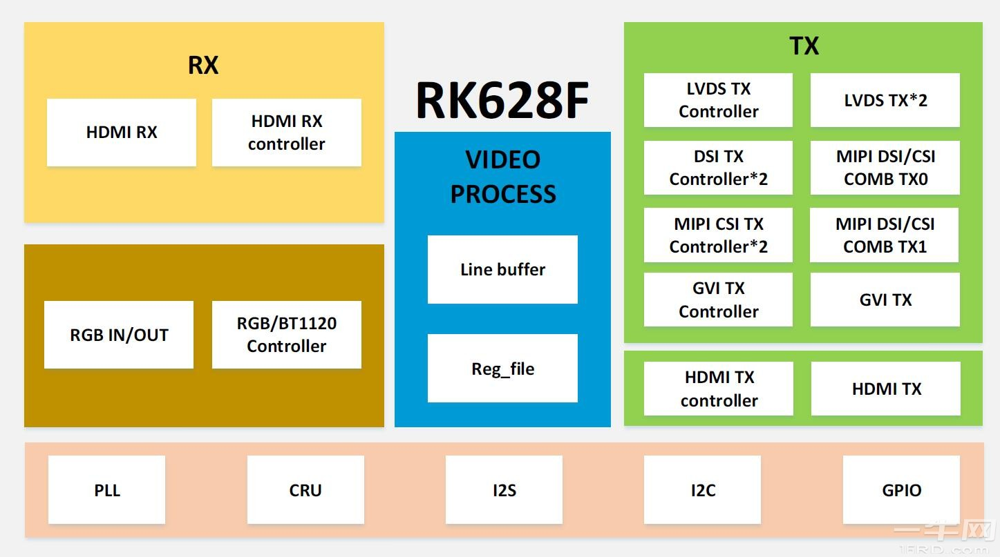

# ✋ Page 4 添加包到镜像中（开源包&自己的程序）

## 前言

上面我们创建了自己的发行版系统，现在我们给我们的发新版系统里面添加我们想要的一些工具或者组件。在面临了一个非常大的问题，是我们没有办法把文件传输进入虚拟机里面。

我们尝试了一下，使用ping来和讯进行通信，通信可以通说明我们可以借助网络来进行工具的传输。所以我们首先需要安装能够支持使用网络传输工具的包。

## 描述自己的镜像文件

Yocto虽然提供了参考镜像描述文件：

## 添加一个软件包

我们使用devtool工具来创建并管理配方：

```bash
core-image-minimal
core-image-full-cmdline
core-image-sato
core-image-weston
```

上面我们基于第一个构建了一个自己的倾向。但是我们配方依然用的是官方的，官方的配方不建议直接更改。基于他自己的官方，我们可以在我们这里增加自己的属性描述文件。

官方image描述路径是：`meta/recipes-core/images/core-image-minimal.bb`

我们也创建这样的描述文件：`meta-rockembedded/recipes-core/image/rocklinuximage.bb`

### 添加一个开源工具&软件&库

### 添加ssh到软件包中

```bash
require recipes-core/images/core-image-minimal.bb

IMAGE_INSTALL:append = " dropbear"
```

构建测试：`bitbake rocklinuximage`

<figure><figcaption></figcaption></figure>

可以看到我们添加的包已经被正确识别并开始构建了。构建完成之后，我们跑一下，测试一下。

<figure><figcaption></figcaption></figure>

可以看到软件包已经被成功添加进来，并且运行成功了，我们测试一下功能。

<figure><figcaption></figcaption></figure>

### 添加自己的软件包

软件帮我们添加两个例子，一个是基于传统的Makefile内容是基于现代CMake

我们先创建两个工程。

## 传统Makefile

按照目录创建如下几个文件：

```bash
hello
├── files
│   ├── hello.c
│   └── Makefile
└── hello_0.1.bb
```

Makefile 和 hello圆满这里就不展开了重点看一下bb配方文件：

```bash
LICENSE = "CLOSED"

SRC_URI = "file://hello.c \
           file://Makefile \
           "

S = "${WORKDIR}"
TARGET_CC_ARCH += "${LDFLAGS}"

do_configure () {
	# Specify any needed configure commands here
	:
}

do_compile () {
	# You will almost certainly need to add additional arguments here
	oe_runmake
}

do_install () {
	install -d ${D}${bindir}
	install -m 0755 hello ${D}${bindir}
}

```

这块儿有几个注意事项。

1. 首先第一行是关闭license
2. 下面是添加我们的源码文件到当前的配方中。
3. 然后是指定当前配方的工程源码目录
4. 最后这一个是额外添加的，因为使用Makefile来构建并不会添加额外的连接器文件。会导致yocto在检查时出现错误
5. 由于需要使用Makefile来编译，所以我们需要手动指定配置，编译和安装的三个过程。

开始编译：

<figure><figcaption></figcaption></figure>

## 现代cmake

按照目录创建下面几个文件

```
hello-cmake
├── files
│   ├── CMakeLists.txt
│   └── hello.c
└── hello-cmake.bb
```


```bash
LICENSE = "CLOSED"

inherit cmake

SRC_URI = "file://hello.c \
           file://CMakeLists.txt \
           "
S = "${WORKDIR}"
```

使用现代cmake工具就不会有Makefile上面的问题，我们只需要指定源码即可。剩下的过程全部交给cmake来完成，包含配置，编译，安装以及依赖。

开始编译：

<figure><figcaption></figcaption></figure>

文章开始我们添加了sh工具，我们现在可以将我们的生成物拷贝进系统中进行测试。我的生成物的目录在：

* `build/tmp/work/cortexa57-rockembedded-linux/hello/0.1-r0/image/usr/bin`
* `build/tmp/work/cortexa57-rockembedded-linux/hello-cmake/1.0-r0/image/usr/bin`

这个生成目录也特别有意思我们下个章节讲。

```
scp hello-cmake root@192.168.7.2:/home/root
scp hello root@192.168.7.2:/home/root
```

<figure><figcaption></figcaption></figure>

可以看到我们的程序。运行并测试成功。

文章的最后，我们将两个工具统一打包在文件镜像中进行测试。我们还在之前的文件中进行添加：

meta-rockembedded/recipes-core/image/rocklinuximage.bb

```
IMAGE_INSTALL:append = "\
    hello \
    hello-cmake \
    "
```

此时我们就发现了之前还没有注意到的几个问题.

<figure><figcaption></figcaption></figure>

需要修改bb文件中添加对应文件跳过描述：

```bash
FILES_${PN} = "${bindir}/"
```

重新运行镜像。就可以看到我们添加在镜像中的文件信息了。

<figure><figcaption></figcaption></figure>

至此，我们自定义发行版的第一阶段就完成了。
