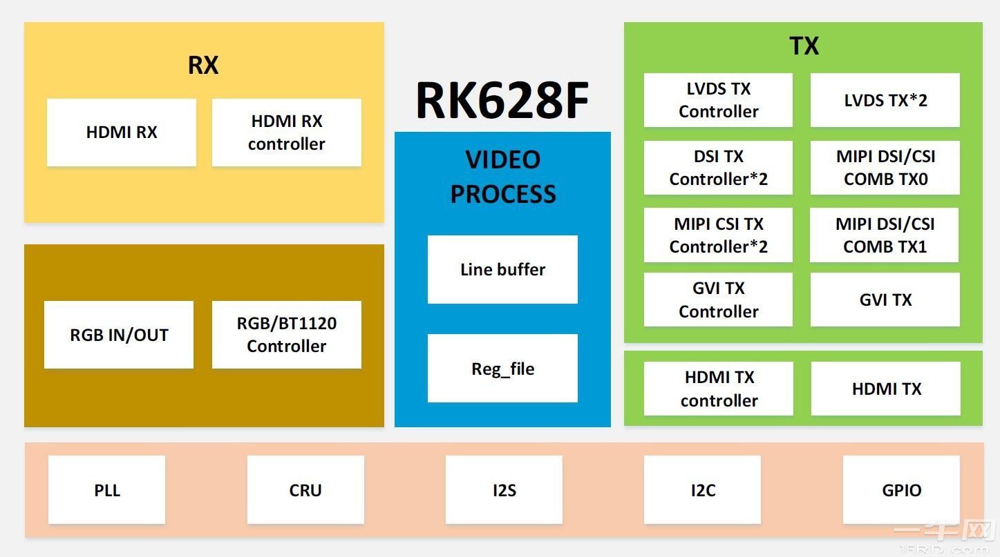

# 🤙 Page 5 修改源码包获取地址加速构建过程

在国内使用Yocto，因为某些懂得都懂的原因，导致我们有很多软件包，一时半会儿可能下载不下来，此时我们就需要寻找对应的方法来加速我们的构建过程。

今天我们就以非常著名的开源软件OpenCV为例，帮助大家在Yocto中集成OpenCV库。

## 查找库支持

首先我们使用这个命令：`bitbake -s | grep opencv` 来查找当前是否可以直接进行构建。

<figure><figcaption></figcaption></figure>

可以发现当前我们这里支持的库会比较少，也没有这个库。原因是我们没有使用他自己的第三方库支持的meta层。这个层就是openembedded: [https://github.com/openembedded/meta-openembedded/tree/kirkstone](https://github.com/openembedded/meta-openembedded/tree/kirkstone)

我们拉取这个仓库到本地：

```sh
git clone -b kirkstone git@github.com:openembedded/meta-openembedded.git
```

拉取的过程中要注意选择我们之前使用的pock版本的分支。

拉取成功之后，将当前的门塔层添加进我们的编译支持目录里面，然后我们再进行查找，看是否能找到我们需要的库。`build/conf/bblayers.conf`

```bash
BBLAYERS ?= " \
  ${TOPDIR}/../meta \
  ${TOPDIR}/../meta-poky \
  ${TOPDIR}/../meta-yocto-bsp \
  ${TOPDIR}/../meta-rockembedded \
  ${TOPDIR}/../meta-openembedded/meta-oe \
  "
```

我们经过查找可以找到我们需要的库的路径

<figure><figcaption></figcaption></figure>

然后我们将对应的层添加进来。暂时我们就添加这一个，其他的先不添加。

```bitbake
  ${TOPDIR}/../meta-openembedded\meta-oe
```

<figure><figcaption></figcaption></figure>

此时我们就可以找到我们需要添加的库。然后我们直接对该库提前编译，我们就会发现需要从Github上去获取Release的发布包，然而我们当前从Github上下载时的速率是比较慢的。

```bash
bitbake opencv
```

<figure><figcaption></figcaption></figure>

这个库的依赖会比较多，所有的应该都需要从零开始下载。然而我们可以看到他自己的下载进度是非常缓慢的。此时我们可以通过寻找镜像的方式来进行加速。

<figure><figcaption></figcaption></figure>

可以看到我们下载版的并不止Opencv一个库，还有它的依赖库。但是我们此时仅加速这一个库。

## 镜像源寻找



我们国内的博客中有记录对于这种库的加速地址。

我们找到库的配方文件：`meta-openembedded/meta-oe/recipes-support/opencv/opencv_4.5.5.bb`

然后将这个库中需要从Github上获取的地址替换为我们的加速地址。

```
-SRC_URI = "git://github.com/opencv/opencv.git;name=opencv;branch=master;protocol=https \
-           git://github.com/opencv/opencv_contrib.git;destsuffix=contrib;name=contrib;branch=master;protocol=https \
-           git://github.com/opencv/opencv_3rdparty.git;branch=ippicv/master_20191018;destsuffix=ipp;name=ipp;protocol=https \
-           git://github.com/opencv/opencv_3rdparty.git;branch=contrib_xfeatures2d_boostdesc_20161012;destsuffix=boostdesc;name=boostdesc;protocol=https \
-           git://github.com/opencv/opencv_3rdparty.git;branch=contrib_xfeatures2d_vgg_20160317;destsuffix=vgg;name=vgg;protocol=https \
-           git://github.com/opencv/opencv_3rdparty.git;branch=contrib_face_alignment_20170818;destsuffix=face;name=face;protocol=https \
-           git://github.com/WeChatCV/opencv_3rdparty.git;branch=wechat_qrcode;destsuffix=wechat_qrcode;name=wechat-qrcode;protocol=https \
+SRC_URI = "git://gitcode.net/opencv/opencv.git;name=opencv;branch=master;protocol=https \
+           git://gitcode.net/opencv/opencv_contrib.git;destsuffix=contrib;name=contrib;branch=master;protocol=https \
+           git://gitcode.net/opencv/opencv_3rdparty.git;branch=ippicv/master_20191018;destsuffix=ipp;name=ipp;protocol=https \
+           git://gitcode.net/opencv/opencv_3rdparty.git;branch=contrib_xfeatures2d_boostdesc_20161012;destsuffix=boostdesc;name=boostdesc;protocol=https \
+           git://gitcode.net/opencv/opencv_3rdparty.git;branch=contrib_xfeatures2d_vgg_20160317;destsuffix=vgg;name=vgg;protocol=https \
+           git://gitcode.net/opencv/opencv_3rdparty.git;branch=contrib_face_alignment_20170818;destsuffix=face;name=face;protocol=https \
+           git://gitcode.net/WeChatCV/opencv_3rdparty.git;branch=wechat_qrcode;destsuffix=wechat_qrcode;name=wechat-qrcode;protocol=https \
```

根据描述将其中的关键词替换为：gitcode.net，这样我们就拥有了从镜像源中下载文件的能力。

<figure><figcaption></figcaption></figure>

我们按下`CRTL + C`然后等待当前的任务执行完成之后就退出停止掉。对OpenCV库的同步过程。

<figure><figcaption></figcaption></figure>

此时我们的代码同步就会快很多。

<figure><figcaption></figcaption></figure>

加速了代码的同步过程，我们也就加速了整个构建过程。硬件我们解决不了，满足不了更快速的构建过程，我们就加速网络文件的获取。最后我们进入我们的build目录来验证一下我们的Opencv是否构建成功。

<figure><figcaption></figcaption></figure>

<figure><figcaption></figcaption></figure>

可以发现我们不论是库还是文件都已经构建成功。
